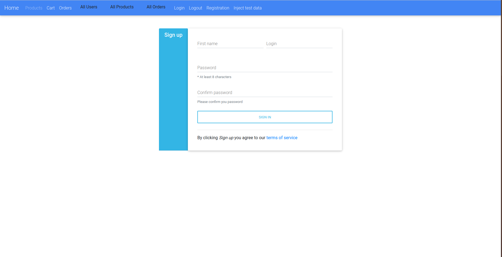
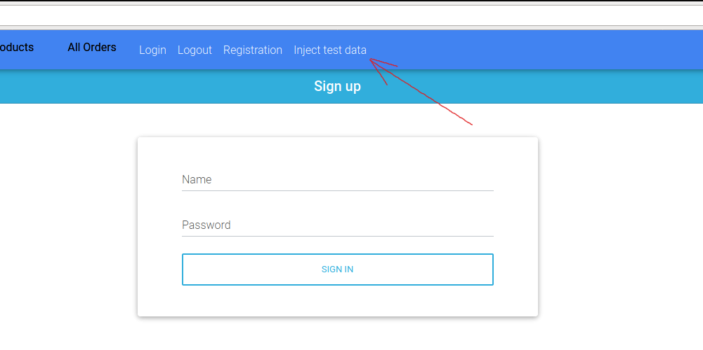

# mate.academy.internetshop

[Project purpose](#project-purpose)

[Project structure](#project-structure)

[Implementation details](#implementation-details)

[Launch guide](#launch-guide)

[Author](#author)

### Project purpose

Web **internet shop** sample with basic features.

Registration, login and logout
- User **_password encryption_**
- User **_authentication and RBAC authorization_**
- Product management
- Adding products to shopping cart and order completion
- Order history and management
- User management

*Non-authorized users allowed to:*

    - view all products
    - register
    - login

*Users with USER role authorized to:*

    - view all products
    - add and remove products from their shopping cart
    - complete order
    - view all their orders

*Users with ADMIN role authorized to:*

    - view all products
    - add / delete products from the products list
    - view / delete all users 
    - view / delete orders
       
This project has been build with MVC pattern with levels:

- Model
- DAO (CRUD-operations)
- Service
- Servlets
- JSP

### Project structure

* Java 11
* Maven 3.8.0
* javax.servlet 3.1.0
* jstl 1.2
* log4j 1.2.17
* maven-checkstyle-plugin
* mysql-connector-java 8.0.20

### Implementation details

_To run this project you need to install:_

- <a href="https://www.oracle.com/java/technologies/javase-jdk11-downloads.html">JDK 11 or higher</a>
- <a href="https://maven.apache.org/download.cgi">Apache Maven</a>
- <a href="https://tomcat.apache.org/download-90.cgi">Apache Tomcat</a>
- <a href="https://dev.mysql.com/downloads/installer/">MySQL RDBMS</a>

Add this project to your IDE as Maven project.

Add Java SDK 11 in project structure.

Configure Tomcat:

    Add artifact
    Add Java SDK 11

Change a path to your Log file in src/main/resources/log4j.properties on line 10.

To work with MySQL you need to:

    Use file src/main/resources/init_db.sql to create schema and all the tables required by this app in MySQL DB
    Change username and password to match with MySQL in src/main/java/internetshop/util/ConnectionUtil.java class on lines 19, 20

Run the project:

Main page by default at URL: .../{context_path}/login

Inject test data (admin, user, products):

User login - userTest, password - 1234
Admin login - adminTest, password - 1234
Enjoy it!

### Author

[Anastasiia](https://github.com/ana-dav)